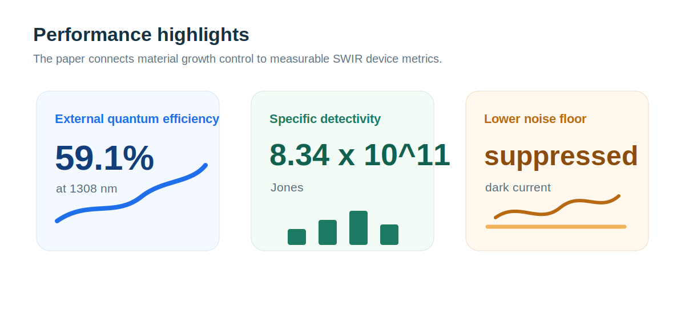

Our collaborative paper “Ligand-directed growth control for high-performance short-wave infrared quantum dot photodetectors” has been published in *Journal of Materials Chemistry C*. The work addresses a central materials challenge in PbS colloidal quantum dot SWIR photodetectors: how to control quantum dot growth, surface passivation, and film packing so that material quality translates into device performance.

<!--more-->

## Paper Information

- Title: Ligand-directed growth control for high-performance short-wave infrared quantum dot photodetectors
- Journal: *Journal of Materials Chemistry C*
- First published: February 4, 2026
- DOI: <https://doi.org/10.1039/D5TC03823E>
- Authors: Yihan Song, Youming Chen, Yiwen Li, Qian Chen, Andong Zhong, Haibo Zhu, Yihong Tang, Fan Fang, Junjie Hao, Haodong Tang, Jiaji Cheng, Yong Xia, Lin Song and Wei Chen

## Why SWIR Quantum Dot Photodetectors?

Short-wave infrared photodetection is useful for imaging, sensing, machine vision, and environmental monitoring. Compared with traditional infrared semiconductor systems, colloidal PbS quantum dots offer tunable bandgaps, solution processing, low-temperature fabrication, and compatibility with large-area manufacturing.

The challenge is that quantum dot films are highly sensitive to surface defects and packing quality. Trap states can increase recombination and dark current, while inefficient coupling between quantum dots can limit carrier transport and device response.

## What Did This Work Do?

The team focused on the quantum dot growth stage. By using 1-octanethiol (OT) together with bis(trimethylsilyl) sulfide (TMS) as double sulfur sources, the work dynamically regulates PbS quantum dot growth and surface passivation.

The strategy can be read in three steps:

1. Tune the OT/TMS ratio during synthesis to control quantum dot morphology and size distribution.
2. Reduce surface defect states through improved passivation and longer carrier lifetimes.
3. Improve the packing and electronic coupling of quantum dot solids, which supports stronger device response.

## Main Results

The optimized OT-QDs showed improved monodispersity, fewer surface defects, and prolonged carrier lifetimes. Structural characterization further indicated that OT drives favorable quantum dot morphology and superlattice ordering, helping to reduce trap density and improve inter-dot electronic coupling.

Device-level highlights include:

- 59.1% external quantum efficiency at 1308 nm.
- 8.34 × 10^11 Jones specific detectivity.
- Suppressed dark current and a lower noise floor.
- A clear link between growth chemistry, film structure, and photodetector performance.

## Figure-Style Reading

Figure 1 can be understood as the research roadmap: the double sulfur source strategy acts during quantum dot formation rather than only after synthesis. The OT/TMS balance affects size distribution, surface states, and packing in the final film.

Figure 2 focuses on structure. Microscopy, optical characterization, and scattering results show how the optimized quantum dots differ in morphology and ordering, providing a material basis for device improvement.

Figures 3 to 5 connect this materials design to photodetector behavior. With fewer traps and stronger quantum dot coupling, photogenerated carriers can be collected more effectively, dark current is reduced, and the final device achieves higher EQE and detectivity.

## Takeaway

This paper shows that high-performance PbS quantum dot SWIR photodetectors can be improved from the source: how the quantum dots grow. Ligand-directed growth control links material chemistry, surface passivation, film packing, and device metrics into one design pathway.

Congratulations to all authors.
