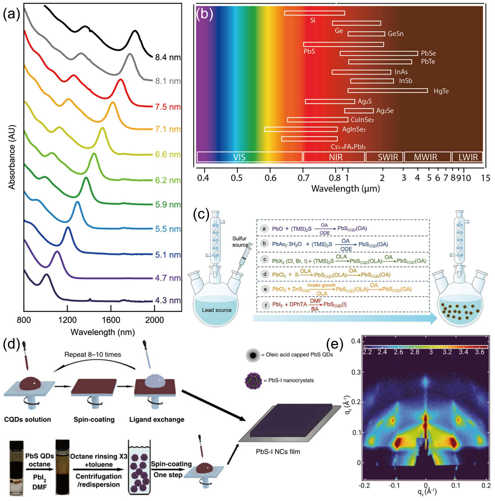
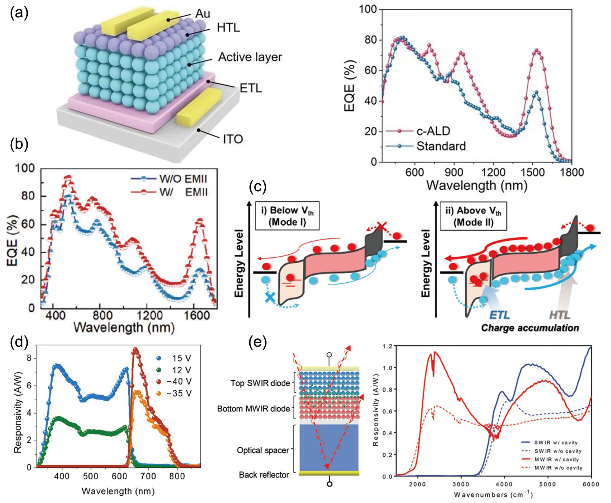
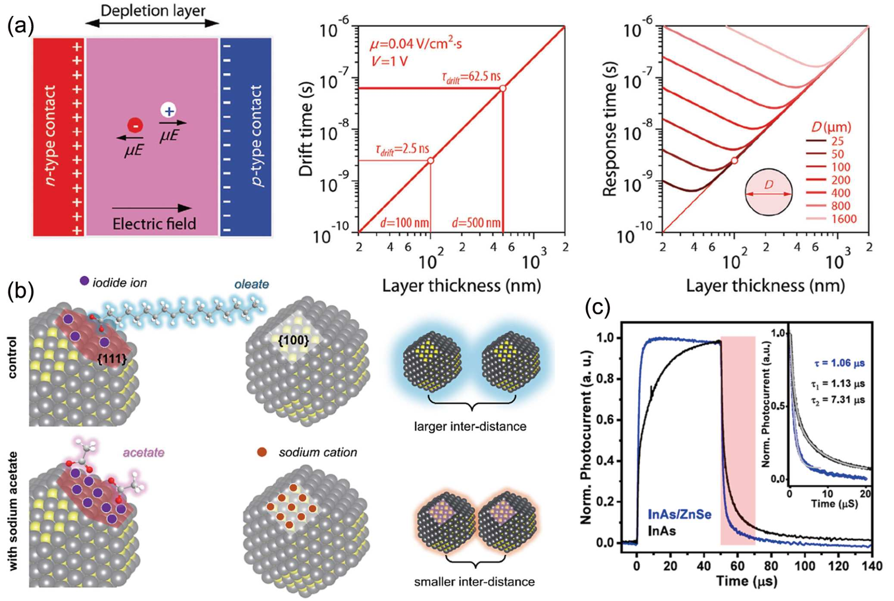

The review article “High-performance shortwave infrared detection and imaging based on colloidal quantum dots” has been published online in *Chinese Science Bulletin*. This highlight uses the original figures extracted from the paper PDF and walks through Figures 1-8 as a figure-led reading of the full CQD-SWIR technology chain.

<!--more-->

## One-Sentence Takeaway

The review is not just about one detector metric. It explains how colloidal quantum dot SWIR detection moves from tunable materials toward deployable imaging systems.

Materials define spectral coverage. Ligands and films define transport quality. Device architectures define dark current, noise, speed, and integration. Readout circuits determine whether the detector can become a practical camera.

## Paper Information

- Title: High-performance shortwave infrared detection and imaging based on colloidal quantum dots
- Chinese title: 高性能胶体量子点短波红外探测及成像技术
- Journal: *Chinese Science Bulletin*
- Online publication: September 30, 2025
- DOI: <https://doi.org/10.1360/CSB-2025-5138>
- Authors: Haodong Tang, Shuo Cheng, Wei Chen, Dan Wu and Kai Wang

## Figure 1: Materials And Films

Short-wave infrared detection, typically covering the 1.2-3 um range, is valuable for night vision, biomedical imaging, industrial inspection, environmental sensing, and optical communication. Conventional InGaAs and InSb systems perform well but remain costly and process-intensive. Colloidal quantum dots offer bandgap tunability, solution processing, and low-temperature compatibility.

Figure 1 sets up the materials foundation. PbS quantum dot absorption shifts with particle size. Different infrared materials cover different spectral windows. Film formation then turns colloidal particles into electronically coupled semiconductor solids through ligand exchange and processing control.

The point is not to list material names. The point is to connect material choice, wavelength range, processing route, stability, and application fit.

## Figure 2: Device Architecture

Absorbing SWIR photons is only the first step. The detector must generate, separate, transport, and read out carriers efficiently.

Figure 2 compares mainstream CQD photodetector structures. Photoconductors are simple and can provide gain, but dark current and speed can be limiting. Photodiodes use built-in fields for carrier separation and are better suited to low-noise, low-power imaging arrays. Phototransistors introduce amplification but require tradeoffs among speed, crosstalk, and fabrication complexity.

Device architecture is therefore not a drawing preference. It defines how the detector handles noise, response speed, operating voltage, and readout compatibility.

## Figure 3: Metrics As Imaging Consequences

Dark current density, noise, responsivity, external quantum efficiency, detectivity, response speed, and linear dynamic range can look like a table of numbers. For imaging, each metric maps to a visible system consequence.

Figure 3 shows how these quantities are measured. J-V curves and dark-current fitting reveal leakage and interface behavior. Noise spectral density sets the weak-signal floor. Responsivity, EQE, and detectivity describe conversion and sensitivity. Response time and bandwidth define frame-rate capability. Linear dynamic range determines whether bright and dark details survive in the same scene.

A good public-facing paper highlight should translate metrics into imaging outcomes: clean dark frames, weak-light visibility, motion blur, and detail retention.

## Figure 4: Dark Current Suppression

For infrared imaging, weak signals are common. High dark current raises the background, burdens readout electronics, and reduces contrast.

Figure 4 summarizes routes for suppressing dark current, including reducing interfacial water adsorption, multilayer ligand exchange and interface optimization, transport-layer treatment, mixed-size quantum dots for improved transport, and low-temperature processing to reduce cracks.

These strategies differ in implementation, but their common goal is the same: reduce leakage pathways and trap-assisted recombination so weak SWIR signals are not buried by the background.

## Figure 5: Conversion Efficiency And Signal Gain

After dark current is controlled, the detector must convert incident photons into a strong electrical signal. Responsivity and EQE directly affect low-light signal-to-noise ratio.

Figure 5 highlights surface reconstruction, cation passivation, high-bias photomultiplication, dual-mode detection, and optical resonant cavities. Some approaches improve surface coupling and passivation, some introduce gain, and some enhance optical absorption.

The important question is not only whether EQE is larger, but where the signal gain comes from. Gain mechanisms must be read together with noise, linearity, bias condition, and stability.

## Figure 6: Linear Dynamic Range

Real scenes rarely contain a single light level. Traffic monitoring, backlit scenes, biomedical imaging, and industrial inspection often include bright and dark regions at the same time.

Figure 6 focuses on LDR. Flexible broadband PbS quantum dot photodiode arrays improve dynamic range by lowering dark current and improving photocarrier extraction. Azide-modified ZnO electron transport layers reduce deep traps and oxygen vacancies, helping the detector maintain a wider linear response.

Higher LDR means bright regions are less likely to saturate while dark details remain visible. For downstream vision algorithms, this can matter more than a single peak metric.

## Figure 7: Response Speed

Response speed is not just a transient curve. It determines frame-rate limits and the ability to capture fast targets.

Figure 7 shows three speed-oriented strategies: ultrathin fully depleted devices with low-capacitance electrode design, sodium-acetate-assisted solid-state ligand exchange for shorter inter-dot spacing and improved extraction, and surface-reconstructed InAs/ZnSe core-shell nanorods for trap passivation.

Fast response is therefore controlled by device capacitance, film thickness, carrier pathways, and interfacial trap density, not simply by applying a higher voltage.

## Figure 8: Readout Integration And Imaging Systems

A strong single detector is not yet an imaging system. Practical SWIR cameras require arrays, readout circuits, low-temperature-compatible processes, and pixel uniformity.

Figure 8 moves the review from devices to systems: CQD SWIR cameras, CMOS integration, and TFT-based low-cost integration. CMOS readout platforms are mature and suitable for high-resolution image sensors, while TFT readout circuits offer potential advantages for low-cost and large-area arrays.

This is the review's key endpoint: CQD-SWIR progress depends on connecting materials, devices, and readout electronics into deployable imaging technology.

## Final Reading

The review can be read as one chain:

Material systems define spectral coverage; ligands and films define carrier transport; device architecture defines dark current, noise, and speed; metrics define image quality; readout integration determines whether the technology can become a camera.

High-performance CQD-SWIR imaging is therefore not the result of a single record number. It is a system-level outcome across materials, films, devices, characterization, and integration.

Congratulations to the authors.

Note: The figures in this post are extracted from Figures 1-8 of the paper PDF for website paper discussion. Please refer to the original article for full figure captions and references.
