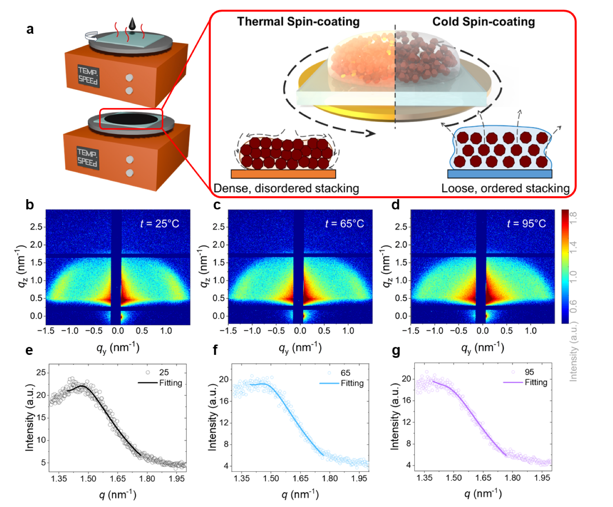
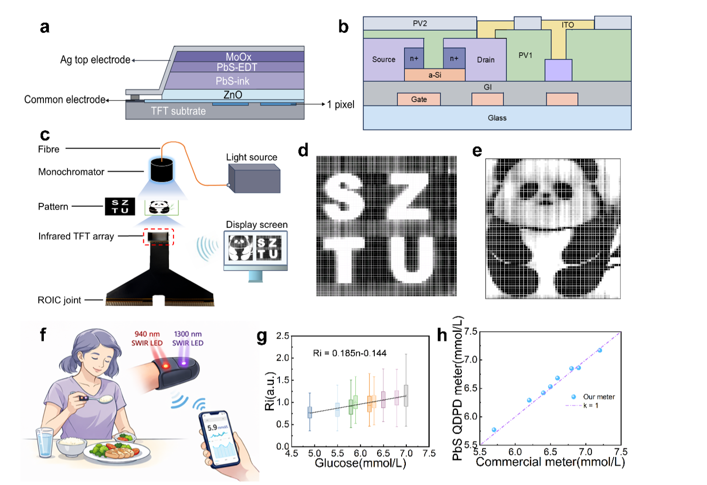

Congratulations to the research teams on the publication of *Thermal Spin Coated PbS QD SWIR Imager for Non-Invasive Glucose Monitoring* in *Advanced Science*.

The work introduces a thermal spin-coating and annealing strategy that regulates solvent evaporation and quantum-dot packing during film deposition. At an optimized substrate temperature of 65 °C, the process produces denser and more uniform PbS quantum-dot films with fewer defects and improved interfacial contact.

<!--more-->

> **The optimized photodetector achieves a responsivity of 0.765 A/W, a specific detectivity of 3.57 × 10¹¹ Jones, a -3 dB bandwidth of 108 kHz, and a linear dynamic range above 100 dB. The devices were further integrated into a 64 × 64 SWIR imaging array and demonstrated for dual-wavelength non-invasive glucose monitoring.**

## Thermal Spin-Coating Controls Quantum-Dot Packing

Solution-processed PbS quantum-dot films can suffer from cracks, voids, surface roughness, and poor interfaces. These defects increase dark current and noise while limiting carrier extraction, response speed, and long-term stability.

The thermal spin-coating strategy accelerates solvent evaporation and shortens the time available for lateral quantum-dot migration. The resulting films show denser packing, while subsequent annealing further reduces local defects.

GISAXS, SEM, and AFM measurements identify 65 °C as the best balance between dense packing and defect control. The improvement is primarily associated with physical packing and interface quality rather than an additional chemical passivation mechanism.

## Improved SWIR Photodetector Performance

The team fabricated vertical ITO/ZnO/PbS-ink/PbS-EDT/MoOₓ/Ag photodetectors. Devices prepared at 65 °C show a peak EQE of 70.8%, lower dark current, stronger photocurrent, and substantially reduced low-frequency noise.

The optimized devices reach 0.765 A/W responsivity and 3.57 × 10¹¹ Jones detectivity. Their rise and fall times are 0.910 μs and 0.976 μs, respectively, with bandwidth increasing from 66 kHz to 108 kHz. They also maintain linear response over more than five orders of optical power.

Unencapsulated devices retained lower dark current and higher EQE after nine months of vacuum storage, demonstrating improved long-term stability.

## From Single Devices to Imaging and Glucose Monitoring

The optimized PbS quantum-dot film was directly integrated with a TFT backplane to form a 64 × 64 SWIR imaging array. The low carrier mobility of the film allows the TFT electrode array to define the pixels without an additional pixel-isolation process.

The array reconstructed clear patterns under 1310 nm illumination. The researchers then used the broadband response of PbS quantum dots for a dual-wavelength measurement at 940 and 1300 nm. The ratio between the two photocurrent signals tracked glucose concentration, and preliminary fingertip measurements followed the trend obtained with a commercial glucose meter.

This result is a proof of concept rather than a clinical validation. It nevertheless demonstrates a complete path from film processing and detector optimization to imaging-array integration and biomedical sensing.

## Paper Information

- Title: Thermal Spin Coated PbS QD SWIR Imager for Non-Invasive Glucose Monitoring
- Journal: *Advanced Science*
- Published online: June 1, 2026
- DOI: <https://doi.org/10.1002/advs.75944>
- Article number: e75944
- Co-first authors: Lei Rao and Shuo Cheng
- Authors: Lei Rao, Shuo Cheng, Qian Chen, Jiankai Wang, Jingrui Ma, Junjie Hao, Xiao Wei Sun, Wei Chen, Cun Zheng Ning, and Haodong Tang
- Corresponding authors: Wei Chen, Junjie Hao, Xiao Wei Sun, Cun Zheng Ning, and Haodong Tang
- Affiliations: Shenzhen Technology University and Southern University of Science and Technology
