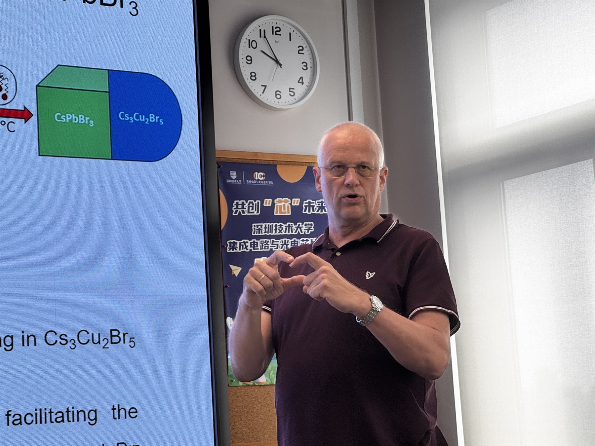

Professor Andrey L. Rogach from City University of Hong Kong visited Shenzhen Technology University, toured the laboratory, and delivered an IC Forum lecture on colloidal metal halide perovskites.

<!--more-->

On June 12, 2026, Professor Andrey L. Rogach, Yeung Kin Man Chair Professor in Photonics Materials at the Department of Materials Science and Engineering and Founding Director of the Centre for Functional Photonics at City University of Hong Kong, visited the College of Integrated Circuits and Optoelectronic Chips at Shenzhen Technology University.

During the visit, Professor Rogach toured the laboratory and exchanged with faculty and students on photonic materials, nanocrystal synthesis, optical spectroscopy, and device-oriented applications. The discussion also covered opportunities for future academic exchange and research collaboration.

Professor Rogach then delivered an IC Forum lecture titled *Heterostructures and Chiral Nano/Microstructures Based on Colloidal Metal Halide Perovskites*. The lecture introduced recent progress in colloidal metal halide perovskite nanocrystals, including nanoheterostructures combining cesium lead halide perovskites with zinc selenide and cesium copper halides, as well as chiral perovskite nano- and microstructures with circularly polarized optical responses.

Professor Rogach's research focuses on the synthesis, assembly, and optical spectroscopy of colloidal semiconductor and metal nanocrystals and their hybrid structures, with applications in energy-related, optoelectronic, and biological fields. He has authored more than 600 scientific publications and has been recognized as a Highly Cited Researcher by Clarivate.

Professor Haodong Tang's group welcomed Professor Rogach's visit and looks forward to continued communication and collaboration in photonic nanomaterials, optoelectronic devices, and related interdisciplinary directions.
