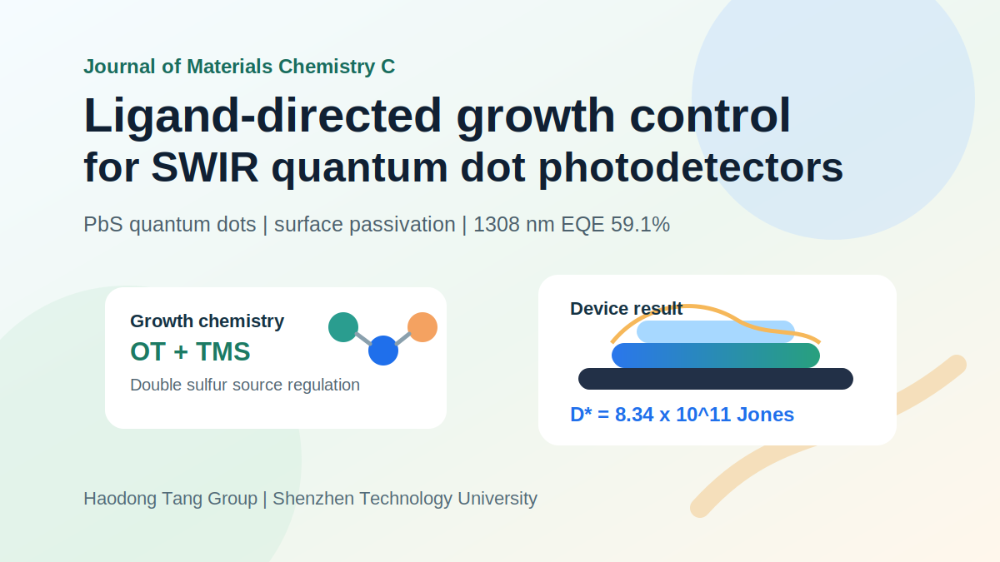
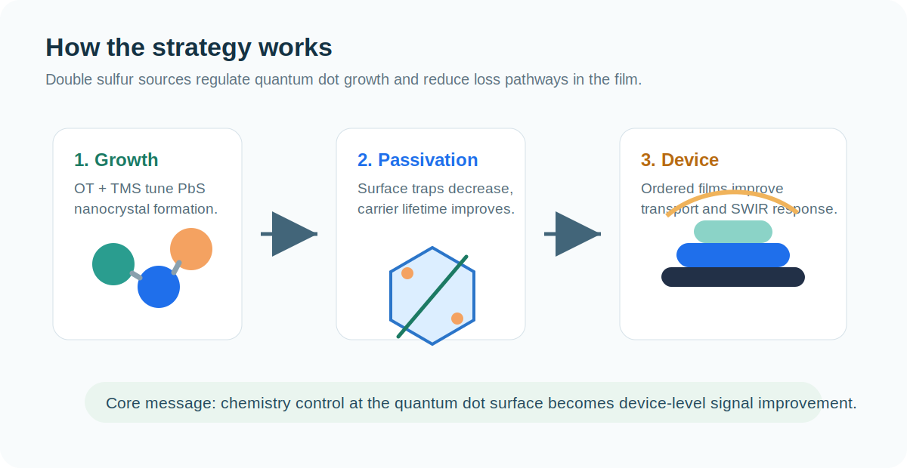

近日，课题组合作论文 “Ligand-directed growth control for high-performance short-wave infrared quantum dot photodetectors” 在 *Journal of Materials Chemistry C* 发表。该工作围绕 PbS 胶体量子点短波红外（SWIR）光电探测器中的材料生长、表面缺陷和薄膜堆积问题，提出了配体导向的量子点生长调控策略。

<!--more-->

## 论文信息

- 题目：Ligand-directed growth control for high-performance short-wave infrared quantum dot photodetectors
- 期刊：*Journal of Materials Chemistry C*
- 时间：2026 年 2 月 4 日首次在线发表
- DOI：<https://doi.org/10.1039/D5TC03823E>
- 作者：Yihan Song, Youming Chen, Yiwen Li, Qian Chen, Andong Zhong, Haibo Zhu, Yihong Tang, Fan Fang, Junjie Hao, Haodong Tang, Jiaji Cheng, Yong Xia, Lin Song and Wei Chen

## 为什么关注 SWIR 量子点探测器？

短波红外探测在生物成像、机器视觉、环境监测和低照度识别等场景中具有重要价值。相比传统 InGaAs 等材料体系，胶体 PbS 量子点具有带隙可调、溶液法加工、低温制备和大面积兼容等优势，因此被认为是低成本 SWIR 探测器的重要候选材料。

但 PbS 量子点薄膜并不是“把材料涂上去”就能自然获得高性能。量子点表面的悬挂键、缺陷态和不理想堆积会带来陷阱辅助复合、暗电流升高和载流子输运受限，最终影响外量子效率、响应速度和比探测率。

## 这篇文章解决了什么问题？

这项工作把关键点放在“量子点生长阶段”。研究团队使用 1-octanethiol（OT）与 bis(trimethylsilyl) sulfide（TMS）作为双硫源，动态调控 PbS 量子点的生长过程与表面钝化。

核心思路可以概括为三步：

1. 在合成阶段调控 OT/TMS 比例，影响 PbS 量子点形貌和尺寸分布。
2. 通过更有效的表面钝化减少缺陷态，延长载流子寿命。
3. 让量子点固体薄膜获得更有利的堆积结构，从材料层面改善器件的暗电流和光响应。

## 文章有哪些结果亮点？

研究发现，优化后的 OT-QDs 具有更好的单分散性、更低的表面缺陷和更长的载流子寿命。结构表征进一步显示，OT 调控会推动量子点形成更有利的形貌和超晶格堆积方式，有助于降低陷阱密度并增强量子点之间的电子耦合。

器件层面的结果同样明确：

- 在 1308 nm 处实现 59.1% 的外量子效率。
- 比探测率达到 8.34 × 10^11 Jones。
- 暗电流得到抑制，器件噪声水平降低。
- 材料生长调控与器件性能提升之间建立了清晰关联。

## 图文解读

图 1 可以理解为研究路线图：双硫源策略并不是简单添加一种配体，而是在量子点成核、生长和表面重构过程中同时发挥作用。OT/TMS 比例的变化，会影响量子点尺寸分布、表面态和最终薄膜中的空间堆积。

图 2 关注结构表征。通过显微形貌、光谱和散射结果，可以看到优化后的量子点在形貌与有序堆积方面发生变化，这为后续器件性能提升提供了材料基础。

图 3 到图 5 则对应器件验证：当表面缺陷减少、量子点间耦合增强后，光生载流子更容易被有效收集，暗电流与噪声受到抑制，最终体现为更高的 EQE 和比探测率。

## 一句话总结

这篇论文说明，高性能 PbS 量子点 SWIR 探测器的突破不只在器件结构，也可以前移到“量子点如何生长”这一材料源头。通过配体导向的生长控制，材料形貌、表面钝化、薄膜堆积和器件性能被串联到同一条逻辑链条中。

祝贺所有作者！
