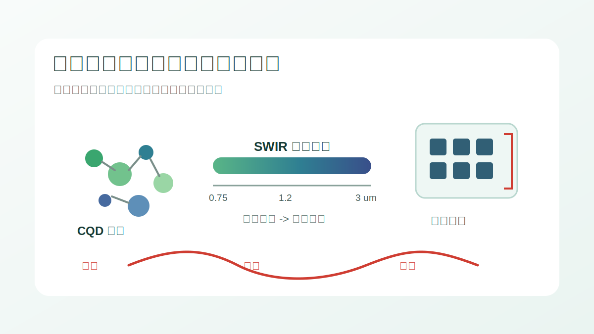
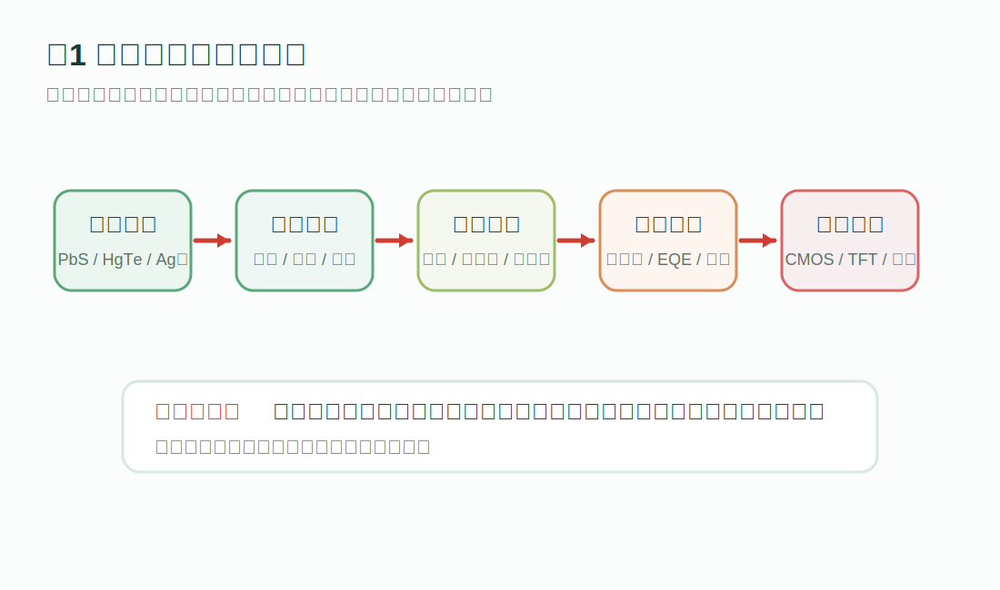
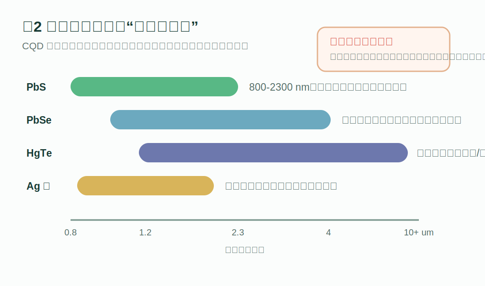
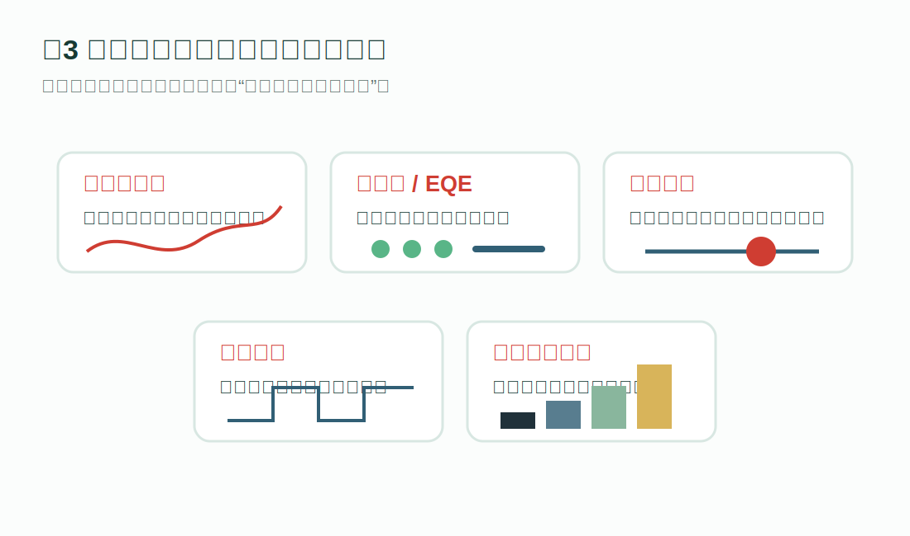
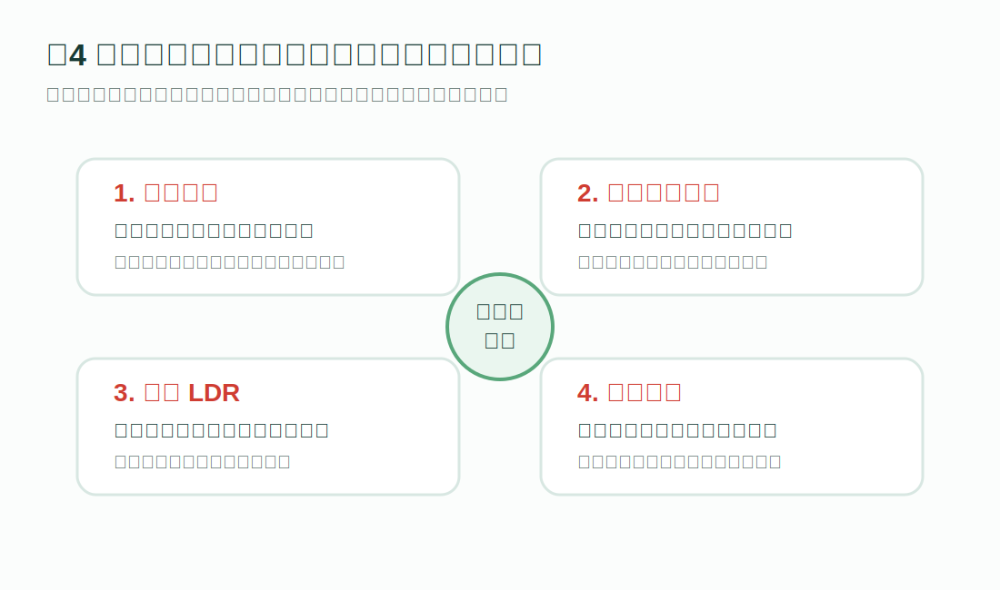
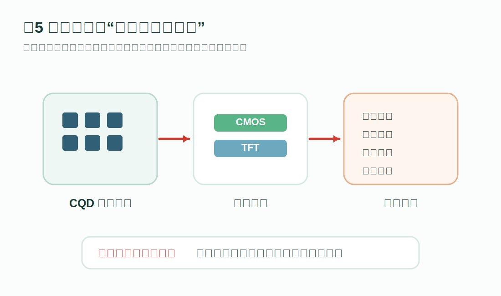

课题组综述文章“高性能胶体量子点短波红外探测及成像技术”已在《科学通报》网络发表。相比只摘录摘要，这篇推送按照公众号式图文解读重新拆开：先讲为什么短波红外重要，再用图把材料、薄膜、器件、性能指标和成像集成串起来。

<!--more-->

## 先看一句话

这篇综述讲的不是某一个单点器件指标，而是一条完整技术链：材料体系决定吸收波段，配体和薄膜决定载流子输运，器件结构决定暗电流、噪声和速度，读出电路集成决定它能不能真正做成短波红外相机。

## 论文信息

- 题目：高性能胶体量子点短波红外探测及成像技术
- 英文题目：High-performance shortwave infrared detection and imaging based on colloidal quantum dots
- 期刊：《科学通报》
- 网络发表：2025 年 9 月 30 日
- DOI：<https://doi.org/10.1360/CSB-2025-5138>
- 作者：唐浩东、程硕、陈威、吴丹、王恺

## 为什么是短波红外？

短波红外（SWIR）通常覆盖 1.2-3 μm 波段。它的价值在于：很多可见光看不清的场景，SWIR 可以提供额外信息。例如低照度夜视、雾霾穿透、半导体检测、生物组织成像、农业水分分析和激光通信。

传统 InGaAs、InSb 等红外探测材料性能好，但成本高、工艺复杂，也不容易低成本大面积集成。胶体量子点（CQDs）的机会就在这里：带隙可调、溶液法加工、低温工艺兼容，还有机会直接走向 CMOS 或 TFT 读出平台。

图1可以作为这篇综述的阅读地图。文章不是按“材料名字”平铺，而是按“材料 -> 薄膜 -> 器件 -> 指标 -> 系统”的顺序展开。这样读，才能看懂每个材料和工艺选择为什么会影响最终图像。

## 第一层：材料决定能看见哪个波段

CQD 的核心优势来自量子限域效应。简单说，量子点尺寸改变，带隙也会改变，吸收边随之移动。因此同一种材料体系也能覆盖不同红外窗口。

这篇综述重点比较了几类红外 CQD 材料：

- PbS 量子点：研究最成熟，吸收范围可覆盖约 800-2300 nm，是目前 SWIR CQD 探测中最重要的材料体系之一。
- PbSe 量子点：本征带隙更小，可延伸到更长波段，但空气稳定性和器件稳定性仍是挑战。
- HgTe 量子点：覆盖范围很宽，可从短波延伸到中波甚至长波红外，是宽谱红外探测的重要方向。
- 银基量子点：低毒、环境友好，是面向消费级和可穿戴应用的潜在替代路线，但性能和稳定性还需要继续提升。

公众号式写法这里不能只列材料名。真正要讲清楚的是：每种材料对应什么波段、什么稳定性问题、什么工艺难度，以及更适合哪类应用。

## 第二层：薄膜不是“涂上去”这么简单

量子点在溶液中通常依赖长链配体保持稳定，但长链配体会拉大量子点之间的距离，阻碍载流子输运。要把胶体材料变成探测器薄膜，就必须处理好配体置换、表面钝化和薄膜堆积。

文章讨论了固相配体置换、液相配体置换、直接墨水法、界面工程等路线。它们共同指向同一个目标：让薄膜更致密、缺陷更少、载流子走得更顺。

这也是 CQD 器件性能经常卡住的地方。材料吸收波段对了，不代表器件一定好；如果表面缺陷多、薄膜裂纹多、量子点间耦合弱，暗电流、噪声和响应速度都会被拖累。

## 第三层：器件结构决定工作方式

文章总结了三类主流器件结构。

光电导器件结构简单、增益高，适合做基础验证，但暗电流较高、响应速度可能受限。光电二极管依靠内建电场分离载流子，更适合低噪声、低功耗和阵列成像。光电三极管可以提供放大能力，但需要处理响应速度、串扰和制备复杂度之间的平衡。

换句话说，器件结构不是画法不同，而是决定了探测器如何收集载流子、如何抑制噪声、如何接入读出电路。

## 第四层：指标要翻译成图像质量

很多论文会列出暗电流密度、响应度、外量子效率、比探测率、响应时间、线性动态范围等指标。读者真正关心的是：这些指标会让图像发生什么变化？

可以这样理解：

- 暗电流密度低，黑场更干净，弱光图像对比度更高。
- 噪声谱密度低，系统能分辨更微弱的光信号。
- 响应度和外量子效率高，意味着同样光强下可以输出更强电信号。
- 比探测率高，说明器件综合灵敏度更强。
- 响应速度快，才能支撑高帧率成像、运动目标识别和激光脉冲捕捉。
- 线性动态范围大，强光和暗部细节才能同时保留下来。

这一段是后续写论文推送的关键：不要把指标当成排行榜，要把指标翻译成读者能感知的图像效果。

## 第五层：性能提升有四条主线

这篇综述把当前高性能 CQD-SWIR 探测器的优化思路归纳得比较清楚。

第一，抑制暗电流。常见方法包括表面钝化、界面层设计、传输层优化和能级势垒调控。核心目的是减少漏电通道和陷阱辅助复合。

第二，提高光电转换效率。材料表面重构、平面阳离子钝化、光学谐振腔和光子倍增机制，都可以增强光吸收或提高载流子收集效率。

第三，扩展线性动态范围。成像系统经常面对强弱光同时存在的场景，如果 LDR 不够，亮部会饱和，暗部会丢细节。这个问题需要材料、器件结构和读出链路一起优化。

第四，加快响应速度。低电容结构、薄膜厚度控制、短载流子输运路径和界面陷阱钝化，是从毫秒、微秒响应走向亚微秒甚至纳秒响应的重要手段。

## 最后一层：能不能变成相机？

高性能探测器最终要进入成像系统。文章最后讨论了 CQD 探测器与读出电路的集成，包括 CMOS 和 TFT 两条方向。

CMOS 读出平台成熟，适合高分辨率图像传感器；TFT 读出电路则在低成本和大面积阵列方面有潜力。随着低温工艺、图案化能力和界面集成能力提升，CQD-SWIR 成像有望进入安防监控、工业检测、医学诊断、农业遥感和消费级夜视设备。

## 这篇综述最值得带走什么？

它把 CQD 短波红外探测从“材料可调”推进到“系统可用”的逻辑讲清楚了。

如果只看材料，重点是带隙和吸收波段；如果看器件，重点是暗电流、噪声、响应度和速度；如果看成像系统，重点就变成阵列一致性、读出电路、功耗、帧率和应用场景。真正的高性能 SWIR 成像，需要这几层同时成立。

祝贺作者团队！

注：本文配图为基于论文内容重新绘制的官网解读示意图，用于说明文章逻辑和技术路线。
