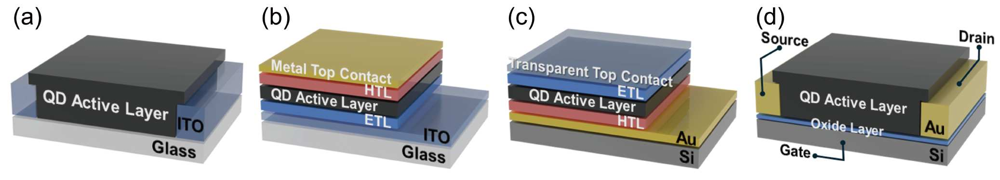
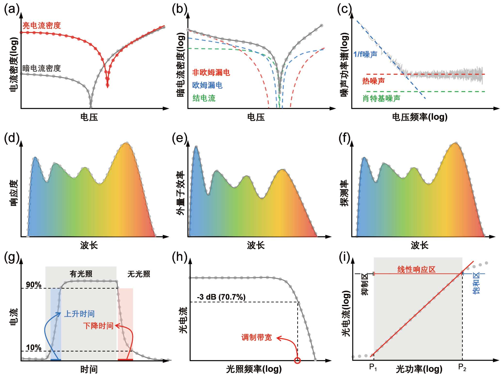
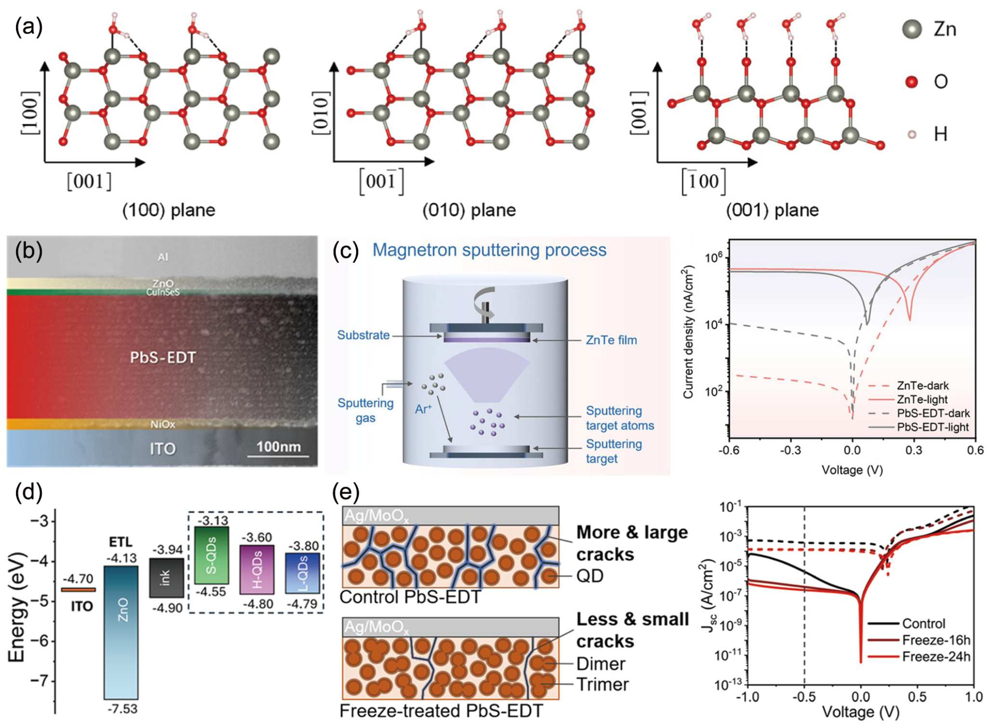
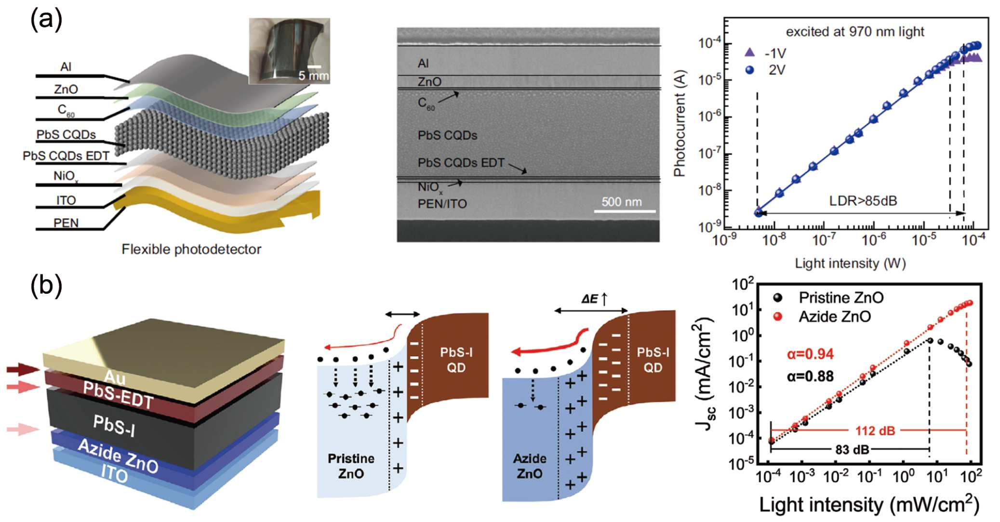
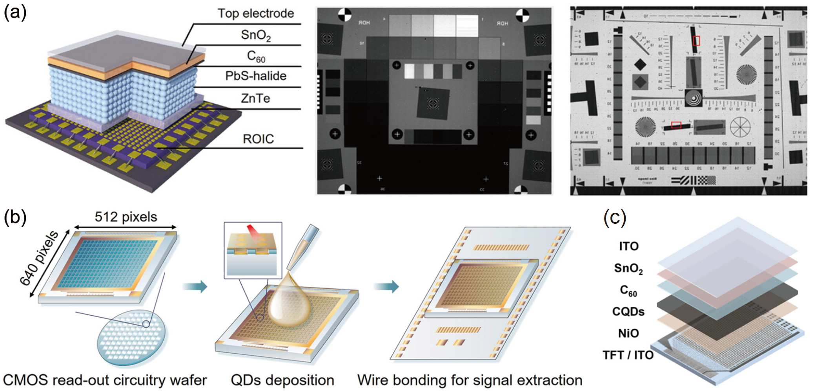

课题组综述文章“高性能胶体量子点短波红外探测及成像技术”已在《科学通报》网络发表。本文按照公众号式图文解读的方式，直接使用论文 PDF 中的原图，围绕 Figure 1-8 逐图拆解胶体量子点短波红外探测与成像技术的完整逻辑。

<!--more-->

## 先看一句话

这篇综述真正要讲清楚的，是胶体量子点短波红外探测如何从“材料可调”走向“系统可用”。

如果只看材料，重点是带隙和吸收波段；如果看器件，重点是暗电流、噪声、响应度和速度；如果看成像系统，重点就变成阵列一致性、读出电路、功耗、帧率和应用场景。

## 论文信息

- 题目：高性能胶体量子点短波红外探测及成像技术
- 英文题目：High-performance shortwave infrared detection and imaging based on colloidal quantum dots
- 期刊：《科学通报》
- 网络发表：2025 年 9 月 30 日
- DOI：<https://doi.org/10.1360/CSB-2025-5138>
- 作者：唐浩东、程硕、陈威、吴丹、王恺

## Figure 1：材料和薄膜，决定“能不能做出来”

短波红外（SWIR）通常覆盖 1.2-3 μm 波段，在夜视增强、生物成像、工业检测、环境感知和激光通信等场景中都有重要价值。传统 InGaAs、InSb 等材料性能好，但成本高、工艺复杂；胶体量子点（CQDs）的优势在于带隙可调、溶液法加工、低温工艺兼容。

Figure 1 把文章的材料基础一次讲清楚：PbS 量子点的吸收峰会随尺寸改变而移动，不同红外材料覆盖不同波段，量子点薄膜则需要通过配体置换和成膜工艺把“胶体材料”变成“可输运的半导体薄膜”。

这里的重点不是材料名字，而是材料、波段、工艺之间的对应关系。PbS 成熟、PbSe 可到更长波段、HgTe 覆盖更宽、银基量子点更低毒，但每条路线都要面对稳定性、工艺和性能之间的取舍。

## Figure 2：器件结构，决定“以什么方式探测”

材料能吸收 SWIR 光，并不代表探测器自然好用。载流子如何产生、分离、传输和读出，取决于器件结构。

Figure 2 对比了几类主流器件结构。光电导器件结构简单、可获得较高增益，但暗电流和响应速度常受限制；光电二极管依靠内建电场分离载流子，更适合低噪声、低功耗阵列；光电三极管可以提供放大能力，但也要平衡速度、串扰和制备复杂度。

所以，器件结构不是“画法不同”，而是决定探测器暗电流、响应速度、工作电压和集成兼容性的关键。

## Figure 3：性能指标，要翻译成图像质量

论文中的暗电流密度、噪声、响应度、外量子效率、比探测率、响应速度、线性动态范围，看起来像一组参数表。但对成像系统来说，它们分别对应很具体的画面问题。

Figure 3 展示了这些指标如何被表征：J-V 曲线和暗电流拟合用于理解漏电与界面问题；噪声谱密度决定弱信号下限；响应度、EQE 和探测率决定光电转换与灵敏度；响应速度和带宽决定能不能做高帧率成像；LDR 决定强弱光共存时能不能保留细节。

后续写论文推送时，不能把指标当排行榜。要把每个指标翻译成读者能感知的成像效果：黑场是否干净、弱光是否可见、运动目标是否拖影、亮暗细节是否同时保留。

## Figure 4：降暗电流，是弱光成像的前提

红外探测器常常工作在弱光条件下。暗电流越高，背景越脏，读出链路压力越大，图像对比度也越差。

Figure 4 总结了几类暗电流抑制策略，包括减少界面水吸附、多层配体置换和界面优化、传输层处理、混合尺寸量子点改善输运，以及通过低温处理减少传输层裂纹。

这些方法虽然形式不同，但目标一致：减少缺陷辅助复合和漏电通道，让弱光信号不被背景噪声淹没。

## Figure 5：提高光电转换效率，让弱光信号更强

暗电流降下来之后，还要让入射光更有效地变成电信号。响应度和 EQE 的提升，直接关系到低照度下的信噪比。

Figure 5 展示了表面重构、平面阳离子钝化、高偏压光子倍增、双模探测和光学谐振腔等路线。它们有的改善量子点表面和晶面耦合，有的引入增益机制，有的增强光吸收。

这一部分的核心是：不是只追求一个更大的 EQE 数字，而是要理解信号增强来自哪里。如果增益来自高偏压或陷阱辅助机制，就还要同步关注噪声、线性范围和稳定性。

## Figure 6：线性动态范围，决定复杂场景能不能看全

实际成像场景很少只有一种光强。夜间交通、逆光场景、组织成像和工业检测中，强光与弱光往往同时存在。

Figure 6 聚焦 LDR。柔性宽带 PbS 量子点光电二极管阵列通过降低暗电流、提升载流子提取效率来改善动态范围；叠氮离子修饰 ZnO 电子传输层则通过减少深能级陷阱和氧空位来提升线性响应能力。

LDR 的提升意味着亮部不容易饱和、暗部不容易丢失。对后端识别算法来说，这些细节往往比单个峰值指标更重要。

## Figure 7：响应速度，决定能不能拍高速画面

响应速度对应的不只是器件曲线，而是成像系统的帧率上限和快速目标捕捉能力。

Figure 7 给出三条高速化路径：超薄全耗尽器件配合低电容电极设计，可以显著缩短响应时间；乙酸钠辅助固相配体交换可以缩短量子点间距、优化载流子提取；表面重构 InAs/ZnSe 核壳纳米棒量子点则通过钝化表面陷阱态来提升速度。

所以，快响应不是单靠“加电压”解决，而是由器件电容、薄膜厚度、载流子路径和界面陷阱共同决定。

## Figure 8：最后要落到相机和读出电路

如果一篇 SWIR 探测论文只停在单个器件，离真正应用还差一步。成像系统需要阵列、读出电路、低温兼容工艺和稳定的像素一致性。

Figure 8 展示了 CQD 短波红外相机、CMOS 集成技术和 TFT 低成本集成方案。CMOS 读出平台成熟，适合高分辨图像传感器；TFT 读出电路则在低成本和大面积阵列方面具有潜力。

这也是这篇综述最重要的落点：CQD-SWIR 的未来不只是“做出一个好器件”，而是把材料、器件和读出电路连接成可部署的成像系统。

## 最后总结

这篇综述可以按一条线来读：

材料体系决定吸收波段；配体和薄膜决定输运质量；器件结构决定暗电流、噪声和速度；性能指标决定图像质量；读出电路决定能否走向真正的相机系统。

换句话说，高性能 CQD-SWIR 成像不是某一个指标的胜利，而是材料、薄膜、器件、表征和系统集成共同成立的结果。

祝贺作者团队！

注：本文图片来自论文 PDF 中的 Figure 1-8，用于官网论文解读；详细图注和参考文献请见原文。
