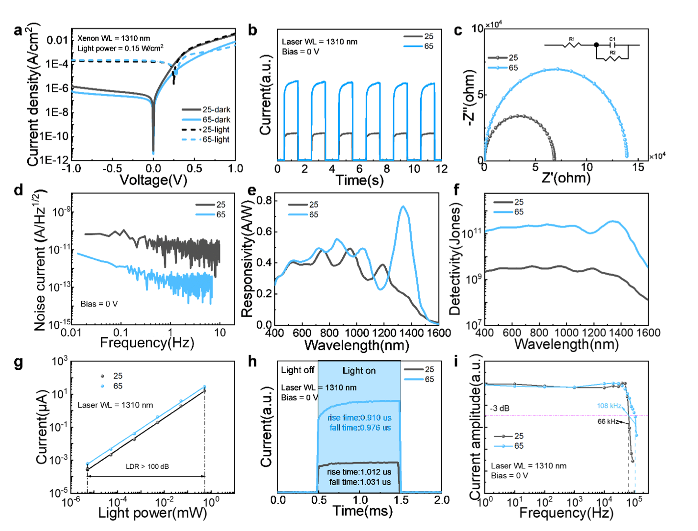

为什么量子点红外探测器已经能“看见”短波红外，却仍然难以真正走向高性能成像和可穿戴生物传感？

为什么同样是 PbS 量子点薄膜，器件常常会被暗电流、噪声、响应速度和长期稳定性同时限制？

如果不额外引入复杂钝化层，也不改变材料配方，仅仅从成膜过程入手，能否把量子点堆得更致密、更稳定，并进一步做成红外成像芯片和无创血糖监测系统？

近日，深圳技术大学唐浩东团队、陈伟团队、郝俊杰团队，联合南方科技大学孙小卫团队等在 *Advanced Science* 发表研究论文 *Thermal Spin Coated PbS QD SWIR Imager for Non-Invasive Glucose Monitoring*，报道了一种热旋涂结合退火的 PbS 胶体量子点薄膜制备策略。

<!--more-->

> **研究表明，在旋涂过程中将基底温度优化至 65 °C，可以调控溶剂挥发动力学和量子点堆积行为，形成更加致密、均匀、低缺陷的 PbS 量子点薄膜。基于该工艺制备的短波红外光电探测器实现了 0.765 A/W 响应度、3.57 × 10¹¹ Jones 探测率、108 kHz 带宽和超过 100 dB 的线性动态范围，并进一步集成为 64 × 64 红外成像阵列，用于双波长比值法无创血糖监测。**

## 为什么关注 PbS 量子点短波红外探测器？

长期以来，PbS 胶体量子点因其带隙可调、吸收覆盖可见至短波红外、可低成本溶液加工等优势，被认为是下一代红外探测和成像芯片的重要候选材料。相比传统外延红外探测器，量子点器件更容易实现大面积制备，也更有希望与 TFT 或 CMOS 读出电路单片集成。

但问题也很直接：溶液加工的量子点薄膜往往容易出现微裂纹、孔洞、表面粗糙和界面接触不良。这些缺陷会带来陷阱态复合和漏电通道，导致暗电流升高、噪声增大、载流子提取效率下降，最终限制器件的灵敏度、响应速度和稳定性。

过去的改进路径多集中在材料或界面层上，例如引入钝化层、调节配体、优化空穴传输层等。上述方法有效，但通常会增加工艺复杂度，也可能影响后续大面积阵列和 CMOS 兼容集成。

该研究则把问题重新拉回到成膜过程本身：量子点在旋涂瞬间到底如何堆积？温度能不能直接改变这种堆积？

## 热旋涂：把性能瓶颈拉回成膜过程

研究团队提出热旋涂策略：在旋涂时升高基底温度，使溶剂更快挥发，压缩量子点横向迁移和自组装的时间窗口。与常规室温旋涂相比，热旋涂会促使量子点快速固化成更致密的堆积结构，后续退火则进一步修复局部缺陷。

GISAXS 结果显示，随着旋涂温度升高，量子点由较有序、较疏松的堆积逐渐转向更紧密、相对无序的堆积。25 °C、65 °C 和 95 °C 样品的量子点间距分别约为 4.33、4.30 和 4.29 nm。也就是说，温度升高确实让量子点靠得更近，电子耦合更强。

但性能提升并非温度越高越好。过高温度也可能带来局部聚集或尾态增加，因此需要在“致密堆积”和“缺陷控制”之间找到最佳窗口。

在本研究中，这个最佳窗口是 65 °C。

进一步的 SEM 和 AFM 结果也支持这一判断。不同温度下薄膜整体都保持连续覆盖，但 65 °C 样品表现出更均匀的表面形貌和最低 RMS 粗糙度。XPS 结果则表明，不同温度下薄膜的主要化学组成没有明显变化，说明性能提升主要来自物理堆积结构和界面质量改善，而不是新的化学钝化效应。

## 从薄膜质量到器件性能

这种成膜机制很快转化为器件性能优势。研究团队构建了 ITO/ZnO/PbS-ink/PbS-EDT/MoOₓ/Ag 垂直结构短波红外光电探测器。65 °C 器件的 EQE 峰值达到 70.8%，明显高于 25 °C 器件的 40.6%。在 1310 nm 照明下，65 °C 器件不仅暗电流更低，光电流也显著增强，说明热旋涂同时改善了漏电抑制和光生载流子提取。

具体来看，65 °C 器件在 0 V 偏压下的响应度达到 0.765 A/W，在 1310 nm 附近表现出更高光响应；其峰值比探测率达到 3.57 × 10¹¹ Jones，优于室温旋涂器件的 1.89 × 10¹¹ Jones。低频噪声谱显示，65 °C 器件的噪声电流相较 25 °C 器件降低近两个数量级，这对低光照成像和高信噪比读出尤为关键。

更重要的是，该工艺并没有以牺牲速度为代价换取灵敏度。65 °C 器件的上升时间和下降时间分别为 0.910 μs 和 0.976 μs，-3 dB 带宽从 25 °C 器件的 66 kHz 提升至 108 kHz。同时，器件在超过五个数量级的光强范围内保持良好线性，线性动态范围超过 100 dB。

> **这说明，热旋涂不是单一地提高某个指标，而是在薄膜致密性、陷阱态抑制、界面输运和噪声控制之间建立了更好的平衡，从而同时提升响应度、探测率、速度和动态范围。**

## 稳定性：从初始高性能走向长期可用

器件稳定性也是量子点红外探测器走向实际应用必须面对的问题。研究团队对未封装器件进行了长达 9 个月的真空储存测试。结果显示，65 °C 器件在老化后仍保持更高 EQE 和更低暗电流。暗电流拟合进一步表明，热旋涂主要通过抑制欧姆漏电和非欧姆陷阱辅助电流来改善长期稳定性。

换句话说，65 °C 热旋涂形成的致密量子点薄膜，不仅初始性能更好，也更能抵抗储存过程中的结构和电学退化。

## 从单像素器件到 64 × 64 成像芯片

在完成单像素器件验证后，研究团队进一步将优化后的 PbS 量子点薄膜直接集成到 TFT 背板上，构建 64 × 64 短波红外成像阵列。由于 PbS 量子点薄膜本身载流子迁移率较低，像素可以由底部 TFT 电极阵列直接定义，而无需额外像素隔离步骤。

这种“无隔离”架构简化了阵列工艺，也为未来高像素密度、CMOS 兼容的量子点红外成像芯片提供了可能。

成像测试显示，该 64 × 64 阵列能够在 1310 nm 短波红外光照下重构清晰图案，证明连续量子点薄膜并未破坏空间分辨能力。进一步，研究团队利用 PbS 量子点宽谱响应特性，设计了 940 nm 和 1300 nm 双波长比值检测策略，用于探索无创血糖监测。

其中，940 nm 位于第一近红外生物窗口，可作为参考通道，用于降低个体差异和背景波动；1300 nm 位于第二近红外窗口，对葡萄糖相关吸收变化更敏感。通过计算 1300 nm 与 940 nm 下平均光电流的比值，研究团队获得了与血糖浓度线性相关的信号。

初步人体指尖测试显示，量子点探测器提取的血糖变化趋势与商用血糖仪结果一致，偏差控制在 5% 以内。

需要强调的是，这一结果仍是概念验证，而非严格临床验证。但它清楚展示了从材料工艺、单器件性能、阵列成像到生物传感应用的完整链条。

## 一句话总结

这项研究的关键意义在于，它证明了量子点红外探测器的性能瓶颈不一定只能依赖复杂材料改性来解决。

通过在成膜瞬间调控溶剂挥发和量子点堆积，热旋涂工艺可以在不增加额外钝化层、不改变材料体系的前提下，显著改善薄膜质量和器件性能，并进一步推动 PbS 量子点短波红外探测器走向成像芯片和可穿戴生物传感应用。

## 论文信息

- 题目：Thermal Spin Coated PbS QD SWIR Imager for Non-Invasive Glucose Monitoring
- 期刊：*Advanced Science*
- 在线发表：2026 年 6 月 1 日
- DOI：<https://doi.org/10.1002/advs.75944>
- 文章编号：e75944
- 第一作者：Lei Rao、Shuo Cheng
- 作者：Lei Rao, Shuo Cheng, Qian Chen, Jiankai Wang, Jingrui Ma, Junjie Hao, Xiao Wei Sun, Wei Chen, Cun Zheng Ning, Haodong Tang
- 通讯作者：Wei Chen、Junjie Hao、Cun Zheng Ning、Haodong Tang、Xiao Wei Sun
- 参与单位：深圳技术大学集成电路与光电芯片学院、深圳技术大学工程物理学院、南方科技大学纳米科学与应用研究院及电子与电气工程系等
